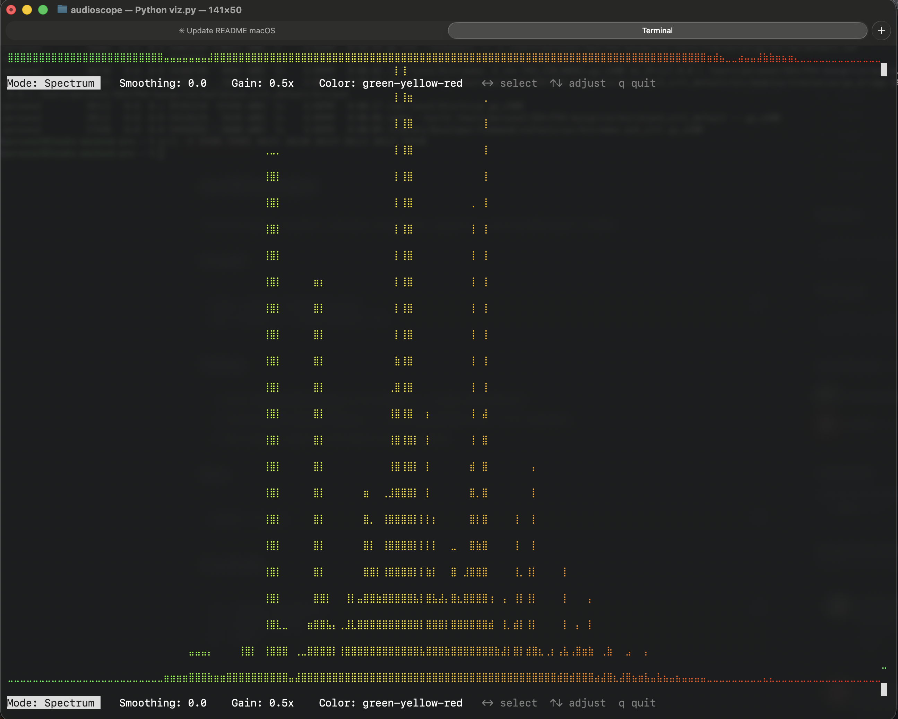

# audioscope

Visualize audio inside your terminal.



## Install

```bash
brew install blackhole-2ch
pip install -r requirements.txt
```

## Setup (MacOS only)

1. Open **Audio MIDI Setup** (Cmd+Space → "Audio MIDI Setup")
2. Create **Multi-Output Device** → check **BlackHole 2ch** + your speakers
3. Set system output to the Multi-Output Device

## Run

```bash
python viz.py
```

## Controls

```
←→  select parameter
↑↓  adjust value
q   quit
```

Parameters: Mode, Style (Braille/Blocks), Gain, Color Theme
